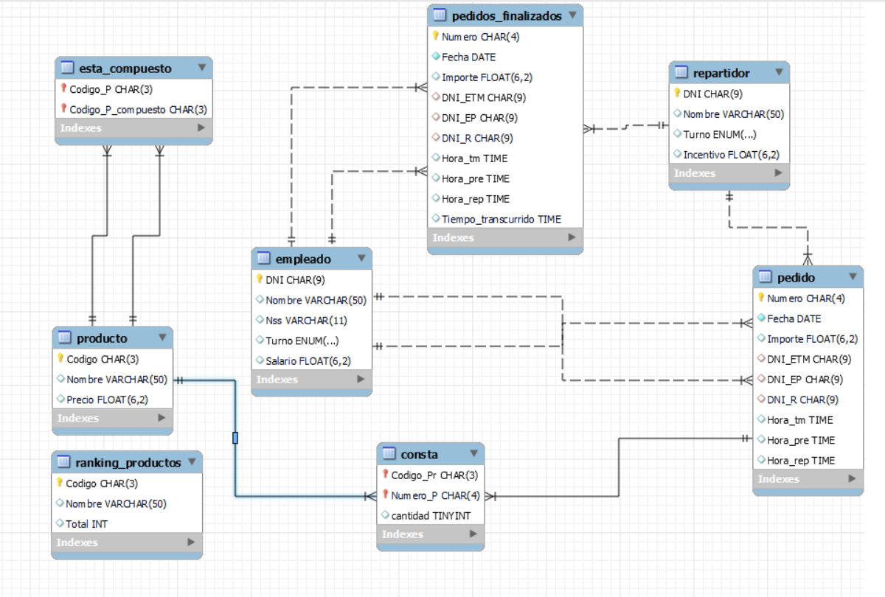

# Analisis DB Pedidos - SQL

Este proyecto es una implementación de una base de datos para un local de comida rápida. La base de datos incluye la tabla principal de pedidos y otras tablas como productos, empleados, repartidores, entre otras. El objetivo principal es responder a una serie de preguntas propuestas por la cátedra utilizando consultas MySQL integradas en Python.

A partir de cada pregunta, se resolvió creando un DataFrame y un archivo `.csv`, los cuales pueden ser visualizados en la carpeta `csv`.

---

## Base de datos

La base de datos utilizada es sobre los pedidos de un local, qué empleados intervinieron en ellos y los productos. Está compuesta por una tabla principal pedidos, la cual se encuentra normalizada y se une al resto de sus tablas mediante PK-FK, obteniéndose el siguiente diagrama de entidad relación:

Este proyecto forma parte un un Bootcamp de Data Analyst en Upgrade Hub. 